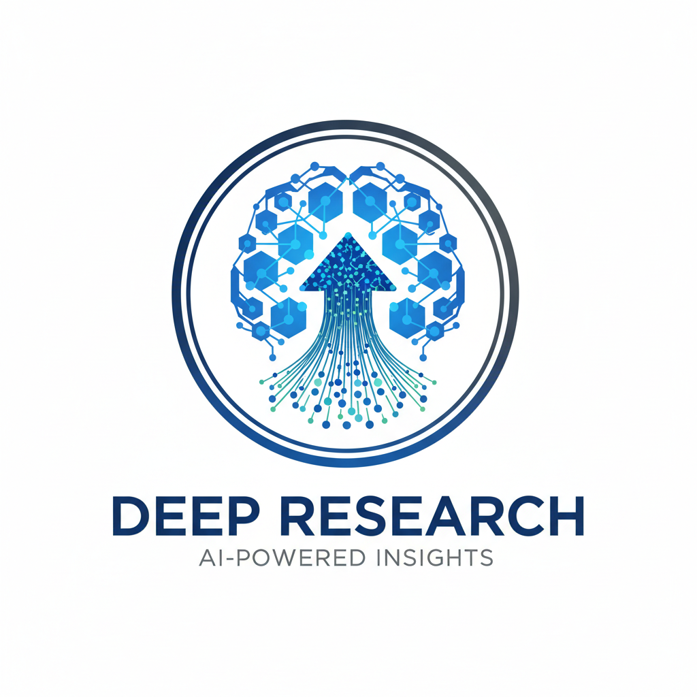

# Deep Research Assistant + Graph RAG with Mastra 🚀🧠

<div align="center">
  <a href="https://github.com/ssdeanx/deep-research" target="_blank" rel="noopener noreferrer">
    <!-- Custom SVG Project Logo -->
    
  </a>
  <h1>Deep Research Assistant + Graph RAG with Mastra 🚀🧠</h1>

  <p align="center">
    <a href="https://github.com/ssdeanx/deep-research/actions/workflows/ci.yml" target="_blank">
      
    </a>
    <a href="https://github.com/ssdeanx/deep-research/blob/develop/LICENSE" target="_blank">
      
    </a>
    <a href="https://github.com/ssdeanx/deep-research/releases" target="_blank">
      
    </a>
    <a href="https://github.com/ssdeanx/deep-research/stargazers" target="_blank">
      
    </a>
    <br />
    
    
    
    
    
    
    
    
    
    
    <br />
    
    
    
    
    
    
    
    
    
  </p>
  </div>

  <p>
    **Beyond Basic Search: Intelligent, Autonomous Research & Reporting**
    <br />
    An cutting-edge, human-in-the-loop AI system designed for advanced deep research, leveraging Mastra's powerful orchestration, agent, and network capabilities. Inspired by lotus wisdom—embracing purity of intent, enlightenment through insight, and adaptive growth—this project fosters ethical AI development, harmonious collaboration, and continuous evolution toward enlightened knowledge discovery.


  </p>

---

<details>
  <summary>Table of Contents 🧭</summary>
  <ol>
    <li><a href="#features">Features</a></li>
    <li><a href="#architecture">Architecture</a></li>
    <li><a href="#agents">AI Agents</a></li>
    <li><a href="#workflows">Workflows</a></li>
    <li><a href="#tools">Tools</a></li>
    <li><a href="#networks">Agent Networks</a></li>
    <li><a href="#rag-pipeline">RAG Pipeline</a></li>
    <li><a href="#memory-processors">Memory Processors</a></li>
    <li><a href="#tracing--observability">Tracing & Observability</a></li>
    <li><a href="#mcp-integration">MCP Integration</a></li>
    <li><a href="#installation">Installation</a></li>
    <li><a href="#quick-start">Quick Start</a></li>
    <li><a href="#usage-examples">Usage Examples</a></li>
    <li><a href="#configuration">Configuration</a></li>
    <li><a href="#api-reference">API Reference</a></li>
    <li><a href="#contributing">Contributing</a></li>
    <li><a href="#license">License</a></li>
  </ol>
</details>

---

## Features ✨

### 🤖 Advanced AI Agents
- **Research Agent**: Multi-phase research with web search, evaluation, and learning extraction
- **Report Agent**: Comprehensive report generation from research data
- **Evaluation Agent**: Content relevance and quality assessment
- **Learning Extraction Agent**: Key insights and follow-up questions generation
- **Web Summarization Agent**: Content condensation and synthesis
- **RAG Agent**: Vector search and retrieval-augmented generation
- **GitHub Agent**: Complete GitHub repository and project management with advanced Copilot integration
- **Monitor Agent**: System health monitoring, performance tracking, and observability specialist
- **Planning Agent**: Strategic planning and project management with resource allocation and risk assessment
- **Quality Assurance Agent**: Software quality management, testing coordination, and defect prevention

### 🎨 Modern React Frontend
- **React 19.1+**: Latest React with concurrent features and automatic batching
- **Vite 7.1+**: Lightning-fast build tool with HMR and optimized production builds
- **TypeScript 5.9+**: Full type safety with advanced language features
- **Tailwind CSS v4.1**: CSS-first configuration with OKLCH colors, text shadows, and modern utilities
- **shadcn/ui Components**: 47 pre-built, accessible UI components with Radix UI primitives
- **React Router v7.8+**: Modern routing with nested routes and data loading
- **Responsive Design**: Mobile-first approach with dark mode support
- **Modern CSS Features**: Container queries, safe area utilities, and browser compatibility

### 🔄 Intelligent Workflows
- **Comprehensive Research Workflow**: End-to-end research process with human-in-the-loop approval
- **Generate Report Workflow**: Automated report creation from research data
- **Research Workflow**: Basic research orchestration
- **GitHub Planning Workflow**: Multi-agent GitHub project management with planning, monitoring, and task generation
- **GitHub Quality Workflow**: Quality-focused workflow composition with planning and QA analysis

### 🛠️ Specialized Tools
- **Web Search Tool**: Intelligent web scraping and content extraction
- **Web Scraper Tool**: Enhanced web scraping with marked.js integration for markdown output and file saving
- **Vector Query Tool**: Semantic search over embedded content
- **Chunker Tool**: Document segmentation for RAG
- **Rerank Tool**: Result relevance optimization
- **Evaluation Tool**: Content quality assessment
- **Learning Extraction Tool**: Insight mining from research data
- **Data File Manager**: 8 comprehensive data management tools (copy, move, search, archive, backup, etc.)

### 🌐 Agent Networks
- **Complex Research Network**: Multi-agent collaboration for advanced research tasks
- **Dynamic agent communication and coordination**

### 🔌 MCP Integration
- **Model Context Protocol**: Standardized AI tool integration
- **Extensible tool ecosystem**
- **Real-time communication capabilities**

### 📊 Advanced Capabilities
- **Advanced RAG Pipeline**: Multi-stage retrieval with vector search, chunking, and reranking
- **Graph RAG**: Knowledge graph-based retrieval and reasoning
- **Vector Search**: Semantic similarity search with multiple indexes
- **Memory Processors**: 11 specialized processors for context optimization
- **Memory Management**: Persistent conversation context with hierarchical memory
- **Human-in-the-Loop**: Interactive approval and refinement
- **OpenTelemetry Tracing**: Comprehensive observability with child spans
- **Zod Validation**: Type-safe data processing
- **Google AI Gemini 2.5**: Advanced features with search grounding and caching
- **LibSQL Storage**: Dual-database architecture for research and vector data

---

## Architecture 🏗️

```
┌─────────────────────────────────────────────────────────────────────┐
│                     Deep Research System                            │
├─────────────────────────────────────────────────────────────────────┤
│  ┌─────────────┐  ┌─────────────┐  ┌─────────────┐  ┌─────────────┐ │
│  │   Agents    │  │  Workflows  │  │   Tools     │  │   Memory    │ │
│  │             │  │             │  │             │  │ Processors  │ │
│  │ • Research  │  │ • Research  │  │ • Web       │  │ • Token     │ │
│  │ • Report    │  │ • Report    │  │ • Vector    │  │ • Personal  │ │
│  │ • Evaluation│  │ • Generate  │  │ • Chunking  │  │ • Error     │ │
│  │ • Learning  │  │ • Complex   │  │ • Rerank    │  │ • Circuit   │ │
│  │ • RAG       │  │ • GitHub    │  │ • MCP       │  │ • Bayesian  │ │
│  │ • GitHub    │  │             │  │ • GitHub    │  │             │ │
│  └─────────────┘  └─────────────┘  └─────────────┘  └─────────────┘ │
├─────────────────────────────────────────────────────────────────────┤
│  ┌─────────────────┐  ┌─────────────┐  ┌─────────────┐  ┌─────────┐ │
│  │   RAG Pipeline  │  │   Storage   │  │   Networks  │  │ Tracing │ │
│  │                 │  │             │  │             │  │         │ │
│  │ • Vector Search │  │ • LibSQL    │  │ • Complex   │  │ • Open  │ │
│  │ • Chunking      │  │ • Vector DB │  │ • Research  │  │ • Tel   │ │
│  │ • Reranking     │  │ • Dual DB   │  │ • Multi-    │  │ • Child │ │
│  │ • Graph RAG     │  │ • Graph DB  │  │ • Agent     │  │ • Spans │ │
│  └─────────────────┘  └─────────────┘  └─────────────┘  └─────────┘ │
├─────────────────────────────────────────────────────────────────────┤
│  ┌─────────────┐  ┌─────────────┐  ┌─────────────┐  ┌─────────────┐ │
│  │   AI/ML     │  │ Integration │  │   APIs      │  │   Caching   │ │
│  │             │  │             │  │             │  │             │ │
│  │ • Google AI │  │ • MCP       │  │ • REST      │  │ • Explicit  │ │
│  │ • Gemini 2.5│  │ • WebSocket │  │ • GraphQL   │  │ • Implicit  │ │
│  │ • Embeddings│  │ • OpenTel   │  │ • GitHub    │  │ • Search    │ │
│  │ • Copilot   │  │ • GitHub    │  │ • Streaming │  │             │ │
│  └─────────────┘  └─────────────┘  └─────────────┘  └─────────────┘ │
└─────────────────────────────────────────────────────────────────────┘
```

### Core Components

#### 🤖 AI Agents
Specialized AI assistants with specific roles and capabilities:
- **Research Agent**: Handles web research, evaluation, and learning extraction
- **Report Agent**: Generates comprehensive reports from research data
- **Evaluation Agent**: Assesses content relevance and quality
- **Learning Extraction Agent**: Extracts key insights and generates follow-up questions
- **Web Summarization Agent**: Condenses and synthesizes web content
- **RAG Agent**: Manages vector search and retrieval-augmented generation
- **GitHub Agent**: Complete GitHub repository and project management with Copilot integration
- **Monitor Agent**: System health monitoring, performance tracking, and observability specialist
- **Planning Agent**: Strategic planning and project management with resource allocation and risk assessment
- **Quality Assurance Agent**: Software quality management, testing coordination, and defect prevention

#### 🎨 Frontend Architecture
Modern React application with seamless Mastra backend integration:

**Core Frontend Components:**
- **App Router**: React Router v7 with nested routes and data loading
- **Layout System**: Responsive navigation with dark mode support
- **Page Components**: Home, Research, Agents, and Workflows pages
- **UI Components**: 47 shadcn/ui components with Radix UI primitives
- **Styling**: Tailwind CSS v4.1 with custom design system
- **State Management**: React hooks with TypeScript integration
- **API Integration**: Mastra client for backend communication

**Frontend-Backend Integration:**
- **Mastra Client**: TypeScript client for API communication
- **Environment Configuration**: Secure API key management
- **Real-time Updates**: Live workflow status and agent responses
- **Error Handling**: Comprehensive error boundaries and user feedback
- **Loading States**: Skeleton components and progressive loading

#### 🔄 Workflows
Orchestrated sequences of operations:
- **Comprehensive Research Workflow**: Complete research pipeline with human approval
- **Generate Report Workflow**: Automated report creation
- **Research Workflow**: Basic research orchestration
- **GitHub Planning Workflow**: Multi-agent GitHub project management with planning, monitoring, and task generation
- **GitHub Quality Workflow**: Quality-focused workflow composition with planning and QA analysis

#### 🛠️ Tools
Specialized utilities for specific tasks:
- **Web Search Tool**: Intelligent web content discovery
- **Web Scraper Tool**: Enhanced web scraping with marked.js integration for markdown output and file saving
- **Vector Query Tool**: Semantic search capabilities
- **Chunker Tool**: Document segmentation for RAG
- **Rerank Tool**: Result optimization
- **Evaluation Tool**: Content assessment
- **Learning Extraction Tool**: Insight mining
- **Data File Manager**: 8 comprehensive data management tools (copy, move, search, archive, backup, etc.)
- **GitHub Tools**: 14 specialized tools for complete GitHub API integration

#### 🌐 Networks
Multi-agent collaboration systems:
- **Complex Research Network**: Advanced multi-agent research coordination

#### 🧠 Memory Processors
Advanced context optimization with 11 specialized processors:
- **TokenLimiterProcessor**: Filters messages exceeding token limits
- **PersonalizationProcessor**: Boosts user-relevant messages
- **ErrorCorrectionProcessor**: Deduplicates content via checksum
- **HierarchicalMemoryProcessor**: Filters episodic vs semantic content
- **CitationExtractorProcessor**: Prioritizes messages with citations
- **MultiPerspectiveProcessor**: Scores messages from multiple viewpoints
- **TemporalReasoningProcessor**: Handles time-based relationships
- **UncertaintyQuantificationProcessor**: Assigns confidence scores
- **KnowledgeGraphProcessor**: Builds knowledge graphs
- **BayesianBeliefProcessor**: Implements Bayesian belief updating
- **CircuitBreakerProcessor**: Provides fault tolerance

#### 🔍 RAG Pipeline
Multi-stage retrieval and generation system:
- **Vector Search**: Semantic similarity search with multiple indexes
- **Chunking**: Intelligent document segmentation with overlap
- **Reranking**: Result relevance optimization
- **Graph RAG**: Knowledge graph-based reasoning
- **Hybrid Search**: Combines vector and keyword search
- **Context Augmentation**: Dynamic context retrieval and ranking

#### 📊 Tracing & Observability
Comprehensive monitoring with OpenTelemetry:
- **Child Spans**: Detailed operation tracking
- **Performance Metrics**: Processing time and resource usage
- **Error Tracking**: Comprehensive error monitoring
- **Health Checks**: System health monitoring
- **Cost Tracking**: API usage and cost optimization

---

## Agents 🤖

### Research Agent
Conducts thorough multi-phase research with web search, content evaluation, and learning extraction.

**Capabilities:**
- Multi-phase research process (initial + follow-up)
- Web search integration
- Content relevance evaluation
- Learning extraction and synthesis
- Follow-up question generation

### Report Agent
Generates comprehensive, well-structured reports from research data.

**Capabilities:**
- Research data synthesis
- Structured report generation
- Markdown formatting
- Executive summaries
- Detailed analysis sections

### Evaluation Agent
Assesses content quality, relevance, and usefulness for research purposes.

**Capabilities:**
- Relevance scoring
- Content quality assessment
- Source credibility evaluation
- Recency analysis
- Comprehensive evaluation metrics

### Learning Extraction Agent
Extracts key insights, patterns, and follow-up questions from research content.

**Capabilities:**
- Key learning identification
- Pattern recognition
- Follow-up question generation
- Content categorization
- Insight synthesis

### Web Summarization Agent
Condenses lengthy web content into actionable summaries while preserving critical information.

**Capabilities:**
- Content analysis and categorization
- Intelligent summarization (80-95% reduction)
- Key insight preservation
- Source context maintenance
- Token optimization

### RAG Agent
Manages vector search and retrieval-augmented generation for enhanced context and responses.

**Capabilities:**
- Vector embedding generation
- Semantic similarity search
- Context retrieval and ranking
- Knowledge augmentation
- Memory integration

### GitHub Agent
Advanced AI-powered GitHub Assistant for complete repository and project management with Copilot integration.

**Capabilities:**
- **Repository Management**: Create, list, update, and delete repositories
- **Issue Management**: Create, update, list, and manage GitHub issues with comments
- **Pull Request Management**: Handle PR creation, updates, merging, and reviews
- **Branch Management**: Create, list, and delete repository branches
- **User & Organization Management**: Search users, manage organization members
- **Advanced Copilot Integration**: Delegate complex coding tasks to GitHub Copilot
- **GitHub API Integration**: Full access to GitHub REST API via Octokit

**Copilot Integration Features:**
- **Task Delegation**: Assign coding tasks to @github-copilot for automated implementation
- **Code Analysis**: Request Copilot analysis and suggestions on pull requests
- **Automated PR Creation**: Copilot generates code and creates pull requests automatically

**Prerequisites:**
- GitHub Copilot Enterprise subscription for advanced features
- Valid GITHUB_API_KEY environment variable
- Appropriate repository permissions

---

## Workflows 🔄

### Comprehensive Research Workflow
End-to-end research pipeline with human-in-the-loop approval.

**Process:**
1. **Query Input**: Interactive user query collection
2. **Web Research**: Multi-phase research execution
3. **Content Evaluation**: Relevance and quality assessment
4. **Learning Extraction**: Key insights and follow-up questions
5. **Data Consolidation**: Research data synthesis
6. **RAG Processing**: Vector search and retrieval
7. **Content Synthesis**: Final content generation
8. **Report Creation**: Comprehensive report generation
9. **Human Approval**: Interactive approval workflow

### Generate Report Workflow
Automated report generation from research data.

**Features:**
- Research data processing
- Structured report formatting
- Content organization
- Executive summaries
- Detailed analysis sections

### Research Workflow
Basic research orchestration for simpler use cases.

**Capabilities:**
- Query processing
- Web search execution
- Basic result evaluation
- Simple report generation

---

## Tools 🛠️

### Web Search Tool
Intelligent web content discovery and extraction.

**Features:**
- Advanced web scraping
- Content relevance filtering
- Source credibility assessment
- Structured data extraction
- Rate limiting and error handling

### Vector Query Tool
Semantic search over embedded content.

**Capabilities:**
- Vector similarity search
- Content ranking and scoring
- Multi-index support
- Query optimization
- Result filtering and sorting

### Chunker Tool
Document segmentation for RAG applications.

**Features:**
- Intelligent text segmentation
- Overlap configuration
- Metadata preservation
- Format support (text, markdown, HTML)
- Chunk size optimization

### Rerank Tool
Result relevance optimization and ranking.

**Capabilities:**
- Multi-criteria ranking
- Semantic relevance scoring
- Position-based weighting
- Custom ranking algorithms
- Performance optimization

### Evaluation Tool
Content quality and relevance assessment.

**Features:**
- Multi-dimensional evaluation
- Scoring algorithms
- Quality metrics
- Relevance assessment
- Automated evaluation pipelines

### Learning Extraction Tool
Insight mining from research data.

**Capabilities:**
- Pattern recognition
- Key learning identification
- Follow-up question generation
- Content categorization
- Insight synthesis and organization

### GitHub Tools
Comprehensive suite of 14 specialized tools for complete GitHub API integration.

**Repository Management Tools:**
- **createRepository**: Create new repositories with custom settings
- **getRepository**: Retrieve detailed repository information
- **updateRepository**: Modify repository settings and metadata
- **deleteRepository**: Remove repositories (with confirmation)
- **listRepositories**: List user repositories with filtering options

**Branch Management Tools:**
- **listBranches**: List all branches in a repository
- **getBranch**: Get detailed branch information
- **createBranch**: Create new branches from existing commits
- **deleteBranch**: Remove branches safely

**Issue Management Tools:**
- **createIssue**: Create new issues with titles and descriptions
- **getIssue**: Retrieve issue details and metadata
- **updateIssue**: Modify issue status, title, and body
- **listIssues**: List repository issues with filtering (open/closed/all)

**Pull Request Management Tools:**
- **createPullRequest**: Create pull requests between branches
- **getPullRequest**: Get detailed PR information
- **updatePullRequest**: Modify PR title, body, and state
- **mergePullRequest**: Merge PRs with various merge methods
- **listPullRequests**: List PRs with status filtering

**Additional Tools:**
- **search**: Advanced GitHub search across repositories
- **getUser**: Retrieve user profile information
- **listOrganizations**: List user organizations
- **createComment**: Add comments to issues and PRs

**All tools support:**
- Full GitHub API integration via Octokit
- Comprehensive error handling and logging
- Type-safe input validation with Zod schemas
- Rate limiting and API quota management

---

## Networks 🌐

### Complex Research Network
Advanced multi-agent collaboration system for complex research tasks.

**Features:**
- Multi-agent coordination
- Dynamic task distribution
- Inter-agent communication
- Collaborative problem-solving
- Network optimization
- Scalable architecture

---

## MCP Integration 🔌

### Model Context Protocol
Standardized integration with AI tools and services.

**Capabilities:**
- Tool discovery and registration
- Real-time communication
- Standardized interfaces
- Extensible architecture
- Cross-platform compatibility

### MCP Server
Custom MCP server implementation for enhanced tool integration.

**Features:**
- Tool registration and management
- Real-time communication channels
- Error handling and recovery
- Performance monitoring
- Security and authentication

**GitHub Tools Integration:**
- All 14 GitHub tools available through MCP
- Standardized tool interface for GitHub operations
- Type-safe API interactions
- Rate limiting and error handling
- Full GitHub API coverage via Octokit

---

## RAG Pipeline 🔍

### Advanced Retrieval-Augmented Generation System

The system implements a sophisticated multi-stage RAG pipeline with the following components:

#### Vector Search & Indexing
- **Multiple Vector Indexes**: Separate indexes for research documents, web content, learnings, and reports
- **Semantic Similarity**: Advanced embedding-based search with configurable similarity thresholds
- **Hybrid Search**: Combines vector similarity with keyword-based search for optimal results
- **Index Management**: Automatic index creation, optimization, and health monitoring

#### Document Processing Pipeline
- **Intelligent Chunking**: Overlapping text segmentation with metadata preservation
- **Content Extraction**: Advanced parsing for various document formats (PDF, HTML, markdown)
- **Metadata Enrichment**: Automatic extraction of titles, authors, dates, and content categories
- **Quality Filtering**: Content validation and relevance scoring

#### Retrieval & Ranking
- **Multi-stage Retrieval**: Initial broad search followed by focused reranking
- **Context Augmentation**: Dynamic context window expansion based on query complexity
- **Relevance Scoring**: Multi-criteria ranking combining semantic similarity, recency, and authority
- **Deduplication**: Intelligent removal of redundant information

#### Graph RAG Integration
- **Knowledge Graph Construction**: Automatic relationship extraction and graph building
- **Graph-based Reasoning**: Path finding and relationship traversal for complex queries
- **Entity Resolution**: Named entity recognition and disambiguation
- **Temporal Reasoning**: Time-based relationship analysis and event sequencing

---

## Memory Processors 🧠

### Advanced Context Optimization System

The system features 11 specialized memory processors designed to optimize context management and information retrieval:

#### Core Processing Categories

**Content Optimization:**
- **TokenLimiterProcessor**: Prevents context overflow by filtering messages exceeding token limits
- **ErrorCorrectionProcessor**: Eliminates duplicate content using checksum-based deduplication
- **CircuitBreakerProcessor**: Provides fault tolerance and prevents cascading failures

**Semantic Enhancement:**
- **PersonalizationProcessor**: Boosts relevance of user-specific content and preferences
- **HierarchicalMemoryProcessor**: Distinguishes between episodic and semantic memory content
- **CitationExtractorProcessor**: Prioritizes messages containing citations and references

**Advanced Reasoning:**
- **MultiPerspectiveProcessor**: Evaluates content from multiple analytical viewpoints
- **TemporalReasoningProcessor**: Handles time-based relationships and chronological ordering
- **UncertaintyQuantificationProcessor**: Assigns confidence scores to information reliability

**Knowledge Integration:**
- **KnowledgeGraphProcessor**: Constructs and maintains knowledge graphs from conversation data
- **BayesianBeliefProcessor**: Implements probabilistic reasoning for belief updating

#### Performance Optimizations
- **WeakMap Caching**: Efficient memory usage with garbage collection-friendly caching
- **Pre-compiled Regex**: Optimized pattern matching for content analysis
- **SIMD-like Processing**: Batch processing optimizations for token estimation
- **Lazy Evaluation**: Deferred computation with memoization for expensive operations

---

## Tracing & Observability 📊

### Comprehensive Monitoring System

The system implements advanced observability using OpenTelemetry for complete system monitoring:

#### Tracing Infrastructure
- **OpenTelemetry Integration**: Industry-standard tracing with vendor-neutral APIs
- **Child Spans**: Detailed operation tracking with hierarchical span relationships
- **Distributed Tracing**: End-to-end request tracking across all system components
- **Custom Span Attributes**: Rich metadata for debugging and performance analysis

#### Performance Monitoring
- **Processing Time Tracking**: Detailed timing for all operations and workflows
- **Resource Usage Metrics**: Memory, CPU, and I/O utilization monitoring
- **API Call Tracking**: Request/response monitoring with error classification
- **Cache Hit Analysis**: Explicit and implicit caching performance metrics

#### Error Tracking & Diagnostics
- **Comprehensive Error Monitoring**: Structured error logging with context
- **Exception Propagation**: Error tracking through the entire call stack
- **Failure Pattern Analysis**: Automated detection of recurring issues
- **Health Check Integration**: System health monitoring with automated recovery

#### Cost Optimization
- **API Usage Tracking**: Detailed cost analysis for external API calls
- **Cache Efficiency Metrics**: Cost savings calculations for cached content
- **Resource Optimization**: Identification of performance bottlenecks
- **Usage Analytics**: Historical usage patterns and trend analysis

---

## Installation 📦

### Prerequisites
- Node.js 20.9+
- npm or pnpm
- Google AI API key
- Database URL (LibSQL)
- GitHub Personal Access Token (for GitHub features)

### Setup
```bash
# Clone the repository
git clone https://github.com/ssdeanx/deep-research.git
cd deep-research

# Install all dependencies (backend + frontend)
npm install

# Copy environment file
cp .env.example .env

# Configure environment variables
# Edit .env with your API keys and configuration
```

### Frontend Setup
The project includes a modern React frontend built with Vite, TypeScript, and Tailwind CSS:

```bash
# Install shadcn/ui components (already included in package.json)
# All 47 UI components are pre-configured and ready to use

# Start the frontend development server
npm run dev:frontend

# Or start both backend and frontend together
npm run dev:full

# Build for production
npm run build:frontend
```

### Backend Setup
The Mastra backend provides the AI orchestration layer:

```bash
# Start the Mastra development server
npm run dev

# Build for production
npm run build

# Start production server
npm run start
```

### Environment Configuration
```env
# Google AI Configuration
GOOGLE_GENERATIVE_AI_API_KEY=your_google_ai_api_key

# Database Configuration
DATABASE_URL=file:./mastra.db

# GitHub API Configuration
GITHUB_API_KEY=your_github_personal_access_token

# Optional: Additional API keys
EXA_API_KEY=your_exa_api_key

# Logging and Monitoring
LOG_LEVEL=info
```

#### GitHub API Setup
To use GitHub features, you need to configure a GitHub Personal Access Token:

1. **Create a Personal Access Token:**
   - Go to GitHub Settings → Developer settings → Personal access tokens → Tokens (classic)
   - Generate a new token with the following permissions:
     - `repo` (Full control of private repositories)
     - `public_repo` (Access public repositories)
     - `read:org` (Read org and team membership)
     - `read:user` (Read ALL user profile data)
     - `read:project` (Read project boards)

2. **Add to Environment:**
   ```env
   GITHUB_API_KEY=ghp_your_token_here
   ```

3. **Copilot Enterprise (Optional):**
   - For advanced Copilot integration features
   - Requires GitHub Copilot Enterprise subscription
   - Enables automated task delegation and code generation

---

## Quick Start 🚀

### Backend API Usage
```typescript
import { mastra } from './src/mastra';

// Start comprehensive research workflow
const workflow = mastra.getWorkflow('comprehensive-research-workflow');
const run = await workflow.createRunAsync();

const result = await run.start({
  inputData: {}
});

// Handle workflow suspension for user input
if (result.status === 'suspended') {
  // Resume with user query
  const resumeResult = await run.resume({
    step: 'get-user-query',
    resumeData: { query: 'quantum computing advancements' }
  });
}
```

### Frontend Usage
```bash
# Start the full-stack application
npm run dev:full

# Frontend will be available at http://localhost:4000
# Backend API will be available at http://localhost:4111
```

**Frontend Features:**
- **Interactive Research Interface**: Start research workflows through the web UI
- **Real-time Workflow Monitoring**: Track workflow progress and status updates
- **Agent Management Dashboard**: View and interact with all available agents
- **Responsive Design**: Works seamlessly on desktop and mobile devices
- **Dark Mode Support**: Automatic theme switching based on system preferences

### Using Individual Agents
```typescript
// Research agent example
const researchAgent = mastra.getAgent('researchAgent');
const researchResult = await researchAgent.generate([
  { role: 'user', content: 'Research AI advancements in healthcare' }
]);

// Report generation
const reportAgent = mastra.getAgent('reportAgent');
const report = await reportAgent.generate([
  { role: 'user', content: `Generate report from: ${researchResult.text}` }
]);
```

### MCP Integration
```bash
# Start MCP server
npm run mcp:server

# The server will be available for MCP-compatible clients
```

---

## Usage Examples 📚

### Complete Research Pipeline
```typescript
import { mastra } from './src/mastra';

async function conductResearch(query: string) {
  // Initialize workflow
  const workflow = mastra.getWorkflow('comprehensive-research-workflow');
  const run = await workflow.createRunAsync();

  // Start research process
  let result = await run.start({ inputData: {} });

  // Handle user query input
  if (result.status === 'suspended') {
    result = await run.resume({
      step: 'get-user-query',
      resumeData: { query }
    });
  }

  // Process through research phases
  // (additional resume calls for other suspension points)

  // Get final result
  if (result.status === 'success') {
    return result.output;
  }
}
```

### Custom Agent Usage
```typescript
// Custom research with specific parameters
const researchAgent = mastra.getAgent('researchAgent');

const result = await researchAgent.generate([
  {
    role: 'user',
    content: `Conduct deep research on: ${topic}
    Focus areas: ${focusAreas.join(', ')}
    Depth level: ${depth}
    Include sources from: ${sources.join(', ')}`
  }
], {
  // Custom generation options
  temperature: 0.7,
  maxTokens: 4000
});
```

### Tool Integration
```typescript
// Direct tool usage
const webSearchTool = mastra.getTool('webSearch');
const searchResults = await webSearchTool.execute({
  context: {
    query: 'artificial intelligence trends 2024',
    limit: 10
  }
});

// Vector search
const vectorTool = mastra.getTool('vectorQuery');
const vectorResults = await vectorTool.execute({
  context: {
    query: 'machine learning algorithms',
    topK: 5,
    indexName: 'research-data'
  }
});
```

### GitHub Agent Usage
```typescript
// Using the GitHub Agent for repository management
const githubAgent = mastra.getAgent('githubAgent');

// Create a new repository
const createResult = await githubAgent.generate([
  {
    role: 'user',
    content: 'Create a new repository called "my-awesome-project" with description "An awesome project" and make it private'
  }
]);

// List user repositories
const listResult = await githubAgent.generate([
  {
    role: 'user',
    content: 'List all my repositories'
  }
]);

// Create and manage issues
const issueResult = await githubAgent.generate([
  {
    role: 'user',
    content: 'Create a new issue in repository "my-org/my-repo" with title "Bug: Login not working" and description "Users cannot log in after recent update"'
  }
]);
```

### GitHub Tools Direct Usage
```typescript
// Direct GitHub tool usage
const createRepoTool = mastra.getTool('createRepository');
const repoResult = await createRepoTool.execute({
  context: {
    name: 'my-new-repo',
    description: 'A new repository created via API',
    private: true
  }
});

// List pull requests
const listPRsTool = mastra.getTool('listPullRequests');
const prsResult = await listPRsTool.execute({
  context: {
    owner: 'my-org',
    repo: 'my-repo',
    state: 'open'
  }
});

// Create a pull request
const createPRTool = mastra.getTool('createPullRequest');
const prResult = await createPRTool.execute({
  context: {
    owner: 'my-org',
    repo: 'my-repo',
    title: 'Add new feature',
    head: 'feature-branch',
    base: 'main',
    body: 'This PR adds a new feature...'
  }
});
```

### Copilot Integration Examples
```typescript
// Delegate a coding task to GitHub Copilot
const copilotResult = await githubAgent.generate([
  {
    role: 'user',
    content: 'Have Copilot implement a user authentication system for repository "my-org/my-app". The system should include login, logout, and password reset functionality.'
  }
]);

// Request Copilot analysis of a pull request
const analysisResult = await githubAgent.generate([
  {
    role: 'user',
    content: 'Ask Copilot to analyze PR #123 in repository "my-org/my-repo" and provide suggestions for improvement'
  }
]);
```

---

## Configuration ⚙️

### Agent Configuration
```typescript
// Custom agent configuration
const customResearchAgent = new Agent({
  name: 'Custom Research Agent',
  instructions: 'Custom research instructions...',
  model: createGemini25Provider('gemini-2.5-flash-lite-preview-06-17', {
    responseModalities: ["TEXT"],
    thinkingConfig: {
      thinkingBudget: -1,
      includeThoughts: false,
    },
    useSearchGrounding: true,
    dynamicRetrieval: true,
    safetyLevel: 'OFF',
    structuredOutputs: true,
  }),
  tools: [webSearchTool, evaluateResultTool],
  memory: createResearchMemory(),
});
```

### Workflow Configuration
```typescript
// Custom workflow configuration
const customWorkflow = createWorkflow({
  id: 'custom-research-workflow',
  inputSchema: z.object({
    query: z.string(),
    depth: z.enum(['shallow', 'medium', 'deep'])
  }),
  outputSchema: z.object({
    results: z.array(z.any()),
    summary: z.string()
  })
})
.then(searchStep)
.then(analyzeStep)
.commit();
```

### Storage Configuration
```typescript
// Advanced LibSQL storage with dual databases
import { createLibSQLStore } from './src/mastra/config/libsql-storage';

const storage = createLibSQLStore({
  tracingContext: {
    context: {},
    runtimeContext: {
      userId: 'user123',
      sessionId: 'session456'
    }
  }
});

// Vector search configuration
const vectorSearch = {
  researchDocuments: {
    indexName: 'research_documents',
    dimensions: 1536,
    metric: 'cosine'
  },
  webContent: {
    indexName: 'web_content',
    dimensions: 1536,
    metric: 'cosine'
  },
  learnings: {
    indexName: 'learnings',
    dimensions: 1536,
    metric: 'cosine'
  }
};
```

### Memory Processor Configuration
```typescript
// Advanced memory configuration with specialized processors
import { createMemoryWithProcessors } from './src/mastra/config/memory-processors';

const memory = createMemoryWithProcessors({
  storage,
  processors: [
    new TokenLimiterProcessor({ maxTokens: 4000 }),
    new PersonalizationProcessor({ userId: 'user123' }),
    new ErrorCorrectionProcessor({ enableChecksum: true }),
    new CircuitBreakerProcessor({ failureThreshold: 5 }),
    new BayesianBeliefProcessor({ confidenceThreshold: 0.8 }),
    new KnowledgeGraphProcessor({ enableRelationships: true })
  ],
  options: {
    lastMessages: 100,
    semanticRecall: {
      topK: 10,
      threshold: 0.7
    }
  }
});
```

### Google AI Configuration
```typescript
// Advanced Google AI configuration with Gemini 2.5 features
import { createMastraGoogleProvider } from './src/mastra/config/googleProvider';

const googleModel = createMastraGoogleProvider('gemini-2.5-flash-lite-preview-06-17', {
  useSearchGrounding: true,
  dynamicRetrieval: true,
  cachedContent: 'cached-research-context',
  safetyLevel: 'MODERATE',
  structuredOutputs: true
});

// Explicit caching setup
const cacheManager = createCacheManager();
const cachedModel = await createCachedGoogleModel('gemini-2.5-flash-preview-05-20', {
  cacheManager,
  cacheContents: [{ role: 'user', parts: [{ text: 'Research context...' }] }],
  cacheTtlSeconds: 300
});
```

---

## API Reference 📖

### Core Classes

#### Mastra
Main application class managing agents, workflows, and tools.

**Methods:**
- `getAgent(name: string): Agent`
- `getWorkflow(name: string): Workflow`
- `getTool(name: string): Tool`
- `getStorage(): Storage`

#### Agent
AI agent with specific capabilities and tools.

**Methods:**
- `generate(messages: Message[], options?: GenerateOptions): Promise<GenerateResult>`
- `stream(messages: Message[], options?: StreamOptions): Promise<StreamResult>`

#### Workflow
Orchestrated sequence of operations.

**Methods:**
- `createRunAsync(): Promise<WorkflowRun>`
- `start(inputData: any): Promise<WorkflowResult>`
- `resume(step: string, resumeData: any): Promise<WorkflowResult>`

### Tool Interface
Standardized tool interface for extensibility.

**Methods:**
- `execute(context: ToolContext): Promise<ToolResult>`

---

## Contributing 🤝

We welcome contributions! Please see our [Contributing Guide](CONTRIBUTING.md) for details.

### Development Setup
```bash
# Fork and clone
git clone https://github.com/your-username/deep-research.git
cd deep-research

# Install dependencies
npm install

# Set up development environment
cp .env.example .env
# Configure your environment variables

# Run tests
npm test

# Start development server
npm run dev
```

### Code Standards
- TypeScript for type safety
- ESLint for code quality
- Prettier for code formatting
- Comprehensive test coverage
- Clear documentation

---

## License 📄

This project is licensed under the ISC License - see the [LICENSE](LICENSE) file for details.

---

## Acknowledgments 🙏

- **Mastra Framework**: For the powerful AI orchestration capabilities
- **Google AI**: For the Gemini models and AI services
- **LibSQL**: For the high-performance database solution
- **OpenTelemetry**: For observability and tracing
- **Zod**: For runtime type validation

---

*Built with ❤️ using Mastra, Google AI, and modern web technologies. Inspired by the pursuit of enlightened knowledge discovery through ethical AI development.*

[](https://app.codacy.com/gh/ssdeanx/deep-research/dashboard?utm_source=gh&utm_medium=referral&utm_content=&utm_campaign=Badge_grade)
[](https://wakatime.com/badge/user/7a2fb9a0-188b-4568-887f-7645f9249e62/project/dec55886-262f-452d-a735-c7e1f6b7a055)
